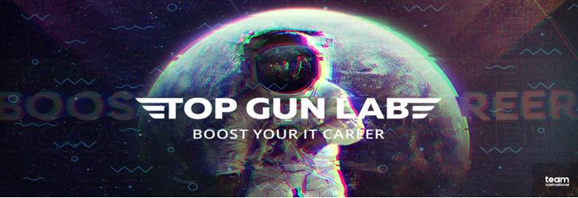

# Blog_TGL_api


[](https://choosealicense.com/licenses/mit/)

# TGL Blog API


This project is an API build with the FastAPI web framework, where you can do CRUD for users, publications and comments. There is an authentication build with JWT module of FastAPI, a connection to a sqlite database, through sqlalchemy. We use the Seaborn library to do a countplot of the data our API recieves. 


## Tech Stack


### **Framework and Web API**
FastAPI: A modern, fast, and highly efficient web framework for building APIs with Python.

### **Database**
**SQLite**: A lightweight and self-contained SQL database engine that's easy to integrate into Python applications.

### **External API Consumption**
**Requests**: A Python library for making HTTP requests to external APIs.

### **Data Manipulation and Analysis**
**NumPy**: A powerful library for numerical operations in Python.

**Pandas**: A versatile library for data manipulation and analysis.

**Seaborn**: A data visualization library based on Matplotlib, which simplifies complex visualizations.

## Features

**User Management**: Create, read, update, and delete user profiles.

**Post Management**: Manage user posts, including creation, retrieval, and deletion.

**Comment System**: Implement a comment system for posts, allowing users to comment on posts.

**Country Information**: Retrieve information about countries, possibly from external APIs.

**External API Integration**: Demonstrate how to integrate and consume data from external APIs.

**Data Analysis**: Utilize NumPy and Pandas for data manipulation and Seaborn for data visualization.

**SQLite Database**: Implement data persistence using SQLite for storing user profiles, posts, and comments.


## Run Locally

Clone the project

```bash
  git clone https://github.com/Saimon2001/Blog_TGL_api.git
```

Go to the project directory

```bash
  cd Blog_TGL_api
```

Create and activate virtual environment using conda

```bash
  conda create -n TGL_fastAPI python=3.9
  conda activate TGL_fastAPI
```

Install dependencies

```bash
  conda env update -f requirements.yml
```

Start the server

```bash
  uvicorn main:app --reload
```


## Authors

- [Simon Londoño Rojas]([https://www.linkedin.com/in/simon-londono-rojas])
- [Daniel Tejada Hernández]([www.linkedin.com/in/dtejadah])


## API Reference

Start the server and see the fastAPI documentation: 
```bash
  localhost:8000/docs
```

## Lessons Learned

We learned to build, debug and imporve a API with FastAPI web framework, we also increased our knowledge of virtual env and git


## Support

For support, email simonlr2001@gmail.com or dtejadah@unal.edu.co.


## Feedback

If you have any feedback, please reach out to us at simonlr2001@gmail.com or dtejadah@unal.edu.co



